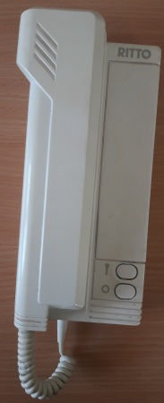
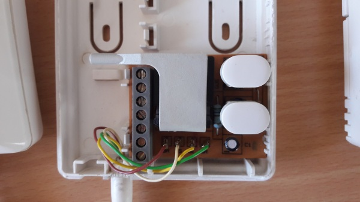
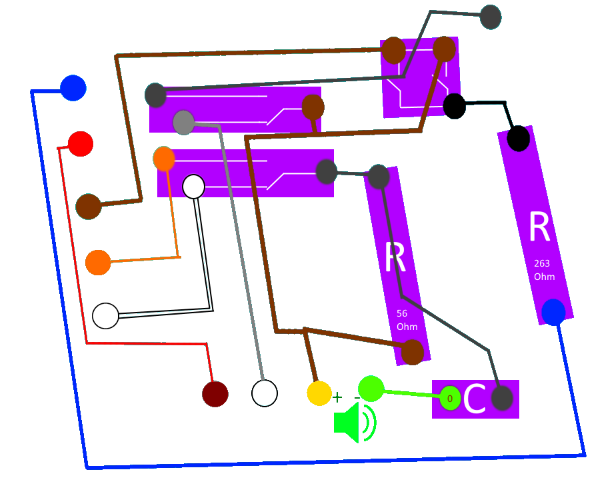
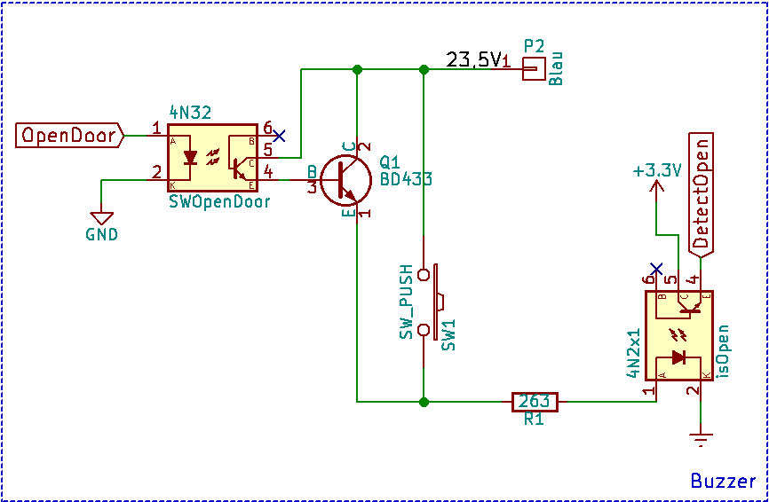
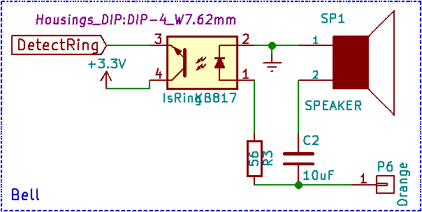
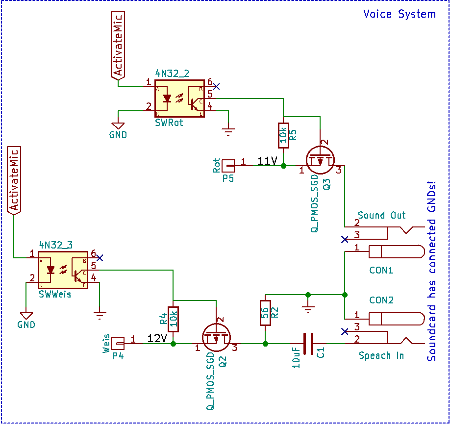

# DoorBerry
Use a Raspberry Pi as a VoIP door intercom system.

I use it with my FritzBox to alert all my DECT Phones.
Tested on a Pi 2B+ and a Pi Zero with raspbian (and mono).

## Software

Please find it [here](https://github.com/User65k/DoorBerryServer).

## Hardware

All Files are creaded with [KiCad](http://kicad-pcb.org/).

### Old Door system

The new System replaces the indoor part of a RITTO intercom system. The Door itself and the other appartments where not modified.

The old system had a fairly simple circut:

### New Door Intercom

The system is replaced by a Raspberry with a custum Hat (utilizing the GPIOs of the Pi).
Bell and Buzzer can operate independently from the new system (in case of Network errors, Bugs, :speak_no_evil:).

The switch (SW1) can open the door regardless of any errors in the Pi.

The speaker (SP1) will notify about someone ringing the Bell independently from the Pi.

